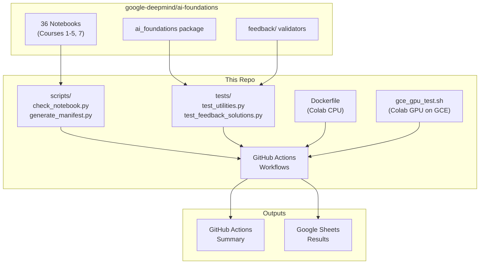
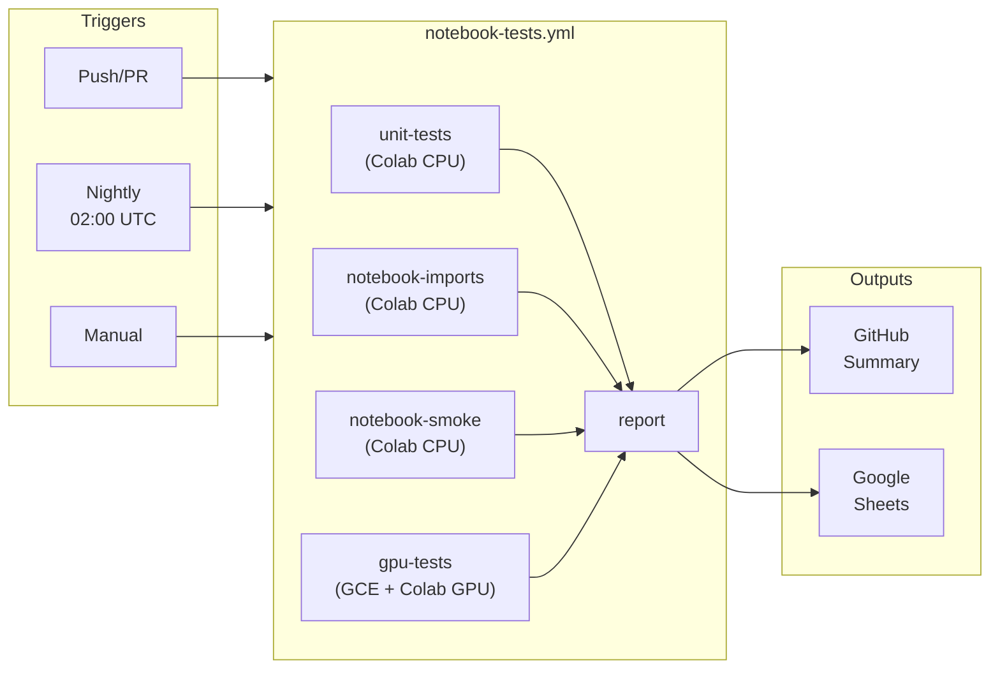
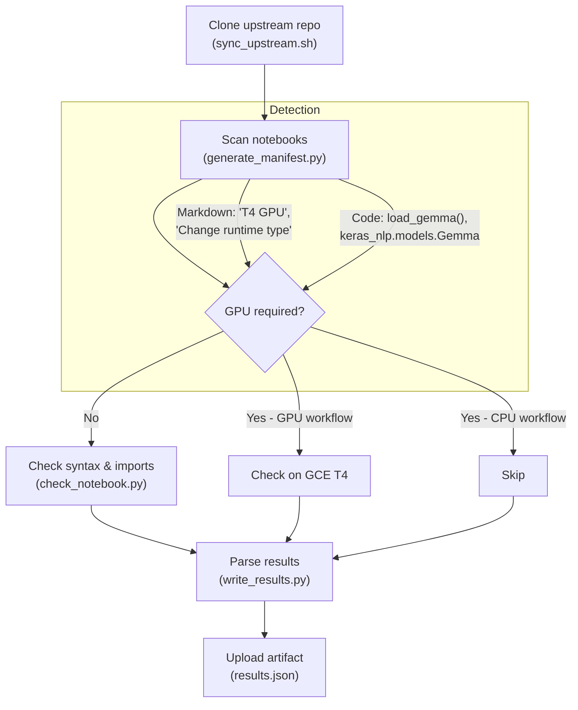
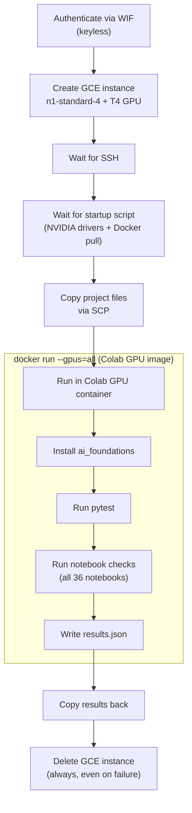

# Automated Notebook Testing for AI Foundations

Automated testing infrastructure for the [google-deepmind/ai-foundations](https://github.com/google-deepmind/ai-foundations) course notebooks.

This repo does **not** contain the notebooks themselves. It clones them fresh from upstream on every CI run to test the latest state.

## Architecture Overview



## Environment Consistency

All tests run inside the **official Google Colab Docker image**. This guarantees results match what students experience on Colab.

| Environment | Docker Image |
|-------------|-------------|
| CPU tests | `us-docker.pkg.dev/colab-images/public/cpu-runtime` |
| GPU tests | `us-docker.pkg.dev/colab-images/public/runtime` |

## GitHub Actions Workflow



| Workflow | Trigger | What it does |
|----------|---------|--------------|
| `notebook-tests.yml` | push/PR, nightly, manual | All jobs + report (main workflow) |
| `unit-tests.yml` | manual only | Standalone pytest |
| `notebook-imports.yml` | manual only | Standalone notebook checks |
| `gpu-tests.yml` | manual only | Standalone GPU tests |

## Notebook Testing Flow



## GPU Testing Flow



## How It Works

### Test suite (`tests/`)

**`test_utilities.py`** - tests pure functions in `ai_foundations`:
- `bytes_to_gb()`, `format_flops()`, `format_large_number()`, `format_qa()`

**`test_feedback_solutions.py`** - dynamically extracts solutions from notebooks and validates them through upstream feedback functions:
- Course 1: n-gram generation, counting, model building, vocabulary
- Course 2: HTML cleaning, Unicode cleaning
- Course 3: MLP design
- Course 4: attention mask computation, transformer parameter counting (7 tests)
- Course 5: QA turn-based formatting
- Course 7: FLOPs estimation, GPU memory calculations (5 tests)

If upstream changes break a solution or a feedback validator, these tests catch it automatically.

### How feedback solution testing works

The upstream notebooks have a pattern: each coding activity has placeholder code (`= ...`) for students to fill in, and a "Solutions" section at the bottom with reference implementations. The upstream `feedback/` module contains validation functions (e.g., `test_clean_html(student_func)`) that take a student's function as an argument and check it against hardcoded test cases.

These validation functions **cannot be run directly with pytest** because they require student code as arguments. Our approach:

1. **Extract** reference solutions dynamically from each notebook's `## Solutions` section at test time using `inject_solutions.py`
2. **Execute** all non-placeholder code cells first (to pick up helper functions, constants, and imports that solutions depend on)
3. **Compile** solution cells in a shared namespace so interdependent functions work
4. **Pass** them into the upstream validation functions as if they were student submissions

```python
# At test time, _extract_solutions() opens the notebook JSON, executes
# helper cells and solution cells, and returns a namespace dict:
ns = _extract_solutions("course_2/gdm_lab_2_1_preprocess_data.ipynb")

# Then the test passes the extracted function to the upstream validator:
def test_clean_html(self):
    from ai_foundations.feedback.course_2 import preprocess
    preprocess.test_clean_html(self.ns["clean_html"])
```

This validates that:
- The solution code is correct (passes the validator)
- The validator logic works (doesn't reject correct solutions)
- The package API hasn't changed (function signatures still match)
- Solutions stay in sync with upstream (no stale hardcoded copies)

### GPU detection

`generate_manifest.py` scans each notebook for GPU signals:

- **Markdown cells:** "Change runtime type", "Hardware Accelerator", "T4 GPU", "must be run on a GPU"
- **Code cells:** `load_gemma(`, `keras_nlp.models.Gemma`, `nvidia-smi`

Notebooks matching any signal are tagged `gpu_required: true`.

### Overrides

Edit `notebook_overrides.yml` to force-skip notebooks or adjust settings:

```yaml
overrides:
  - path: course_5/gdm_lab_5_4_full_parameter_fine_tuning_of_gemma.ipynb
    skip: true
    reason: "Requires Kaggle credentials for Gemma model download"
```

## Local Testing

### Using Docker (recommended)

Docker provides the exact Colab environment.

```bash
# Run all CPU tests (pytest + notebook checks)
docker compose run test

# Run only pytest
docker compose run pytest

# Run only notebook checks
docker compose run check

# Drop into a shell for debugging
docker compose run shell
```

### Using uv (without Docker)

```bash
# 1. Install uv (if not already installed)
curl -LsSf https://astral.sh/uv/install.sh | sh

# 2. Create the virtual environment and install dependencies
uv sync --extra cpu

# 3. Activate the virtual environment
source .venv/bin/activate

# 4. Clone the upstream repo
bash scripts/sync_upstream.sh

# 5. Install the ai_foundations package
uv pip install --no-deps -e ai-foundations

# 6. Run tests
uv run pytest tests/ -v --import-mode=importlib
uv run python scripts/generate_manifest.py
uv run python scripts/check_notebook.py --all --skip-gpu
```

Note: results may differ from Colab due to Python version and package differences.

### Run GPU tests locally

Requires `gcloud` CLI authenticated with a project that has T4 GPU quota.

```bash
# Full run: create instance, run tests, delete instance
./scripts/gce_gpu_test.sh

# Syntax/import checks only (faster)
./scripts/gce_gpu_test.sh --check-only

# Keep instance alive after tests (for debugging)
./scripts/gce_gpu_test.sh --keep
```

## Setting up GCP Workload Identity Federation

The `gpu-tests.yml` workflow authenticates to GCP using Workload Identity Federation (keyless). This requires a one-time setup.

### 1. Create a service account

```bash
export PROJECT_ID="your-project-id"
export PROJECT_NUMBER=$(gcloud projects describe $PROJECT_ID --format="value(projectNumber)")
export GITHUB_ORG="your-github-org"
export GITHUB_REPO="automated-rota-testing"

gcloud iam service-accounts create notebook-ci-runner \
  --display-name="Notebook CI Runner"

gcloud projects add-iam-policy-binding $PROJECT_ID \
  --member="serviceAccount:notebook-ci-runner@${PROJECT_ID}.iam.gserviceaccount.com" \
  --role="roles/compute.admin"
```

### 2. Create a Workload Identity Pool and Provider

```bash
gcloud iam workload-identity-pools create "github-pool" \
  --location="global" \
  --display-name="GitHub Actions Pool"

gcloud iam workload-identity-pools providers create-oidc "github-provider" \
  --location="global" \
  --workload-identity-pool="github-pool" \
  --display-name="GitHub Provider" \
  --attribute-mapping="google.subject=assertion.sub,attribute.repository=assertion.repository" \
  --issuer-uri="https://token.actions.githubusercontent.com"
```

### 3. Allow your GitHub repo to impersonate the service account

```bash
gcloud iam service-accounts add-iam-policy-binding \
  notebook-ci-runner@${PROJECT_ID}.iam.gserviceaccount.com \
  --role="roles/iam.workloadIdentityUser" \
  --member="principalSet://iam.googleapis.com/projects/${PROJECT_NUMBER}/locations/global/workloadIdentityPools/github-pool/attribute.repository/${GITHUB_ORG}/${GITHUB_REPO}"
```

### 4. Add GitHub secrets

Add these secrets to your GitHub repository (Settings > Secrets and variables > Actions):

| Secret | Value |
|--------|-------|
| `GCP_WORKLOAD_IDENTITY_PROVIDER` | `projects/<PROJECT_NUMBER>/locations/global/workloadIdentityPools/github-pool/providers/github-provider` |
| `GCP_SERVICE_ACCOUNT` | `notebook-ci-runner@<PROJECT_ID>.iam.gserviceaccount.com` |
| `GOOGLE_SPREADSHEET_ID` | The spreadsheet ID from the Google Sheets URL |

### 5. Enable required APIs

```bash
gcloud services enable iamcredentials.googleapis.com
gcloud services enable compute.googleapis.com
gcloud services enable sheets.googleapis.com
gcloud services enable drive.googleapis.com
```

### 6. Share the results spreadsheet with the service account

Share the Google Sheets results spreadsheet with the service account email as an **Editor**:

```
notebook-ci-runner@<PROJECT_ID>.iam.gserviceaccount.com
```

## Project Structure

```
automated-rota-testing/
├── .github/
│   └── workflows/
│       ├── notebook-tests.yml          # Main workflow: all jobs + report
│       ├── unit-tests.yml              # Standalone pytest (manual)
│       ├── notebook-imports.yml        # Standalone notebook checks (manual)
│       └── gpu-tests.yml               # Standalone GPU tests (manual)
├── tests/
│   ├── test_utilities.py               # Tests for ai_foundations utility functions
│   └── test_feedback_solutions.py      # Solution code through feedback validators
├── scripts/
│   ├── sync_upstream.sh                # Shallow-clone upstream repo
│   ├── generate_manifest.py            # Auto-classify notebooks (GPU/CPU)
│   ├── check_notebook.py               # Validate notebook syntax and imports
│   ├── write_results.py                # Parse test outputs into structured JSON
│   ├── write_to_sheets.py              # Append results to Google Sheets
│   ├── gce_gpu_test.sh                 # Local: ephemeral GCE GPU instance lifecycle
│   ├── gce_startup.sh                  # Startup script for GCE GPU instance
│   ├── gce_install_deps.sh             # Install deps inside Colab Docker container
│   ├── inject_solutions.py             # Extract and inject solutions from notebook cells
│   └── run_notebook.py                 # Execute notebook via papermill (unused)
├── Dockerfile                          # Colab CPU image for CI and local testing
├── Dockerfile.gpu                      # Colab GPU image for GPU testing
├── docker-compose.yml                  # Local Docker testing commands
├── pyproject.toml                      # Project dependencies (cpu/gpu/sheets extras)
├── uv.lock                             # Locked dependency versions
├── notebook_overrides.yml              # Manual skip/timeout overrides
└── README.md
```

## Notebook Classification

| Category | Count | Notes |
|----------|-------|-------|
| CPU-only | 21 | Tested in Colab CPU container |
| GPU-required | 15 | Tested in Colab GPU container on GCE T4 |
| Total | 36 | Across courses 1-5 and 7 |

## Potential Failure Modes

- [x] **Upstream package changes** → feedback validators or utility functions change signatures. Caught by `test_feedback_solutions.py` and `test_utilities.py`.
- [x] **Upstream solution code changes** → reference solutions no longer pass validators. Caught by `test_feedback_solutions.py` which dynamically extracts solutions from notebooks at test time.
- [x] **Broken imports in notebooks** → upstream adds/renames a dependency. Caught by `check_notebook.py` import validation.
- [x] **Notebook pip install version conflicts** → notebooks pin specific package versions (e.g., `keras==3.13.2 keras_hub==0.26.0`) that conflict with the base environment. Resolved by `check_notebook.py` extracting and running `!pip install` lines before checking imports, using subprocess-based import verification to avoid stale `sys.modules` caching.
- [x] **Syntax errors in notebooks** → upstream introduces invalid Python. Caught by `check_notebook.py` syntax validation.
- [x] **Python version incompatibility** → code works on one Python version but not another (e.g., f-string backslash in 3.10 vs 3.12). Caught by running in the exact Colab Docker image.
- [x] **Package version mismatch** → tests pass locally but fail on Colab due to different package versions. Resolved by using the official Colab Docker image everywhere.
- [x] **GCE instance not cleaned up** → GPU test fails mid-run, leaving an orphaned instance. Resolved by `trap cleanup EXIT` in local script and `if: always()` in GitHub Actions.
- [x] **SSH connectivity to GCE** → firewall rules, OS Login, or key issues block SSH. Resolved by using the correct VPC network, `StrictHostKeyChecking=no`, and timeout-based retry loops.
- [x] **Docker entrypoint conflict** → Colab image starts Jupyter by default instead of running tests. Resolved with `--entrypoint ''` on all `docker run` commands.
- [x] **Service account Drive quota** → service account has no Drive storage, can't create spreadsheets. Resolved by appending to a pre-existing shared spreadsheet instead of creating new files.
- [x] **`tokenize` module shadowing** → upstream `feedback/course_2/tokenize/` directory shadows Python's stdlib `tokenize`. Resolved by not running pytest directly on the feedback folder.
- [x] **Placeholder cells cause syntax errors** → student activity cells with `= ...` fail `ast.parse`. Resolved by detecting and skipping placeholder cells in `check_notebook.py`.
- [x] **Multi-line function signatures** → solution injection fails on functions with signatures spanning multiple lines. Resolved in `inject_solutions.py` by waiting for the closing `:` before checking indentation.
- [ ] **New notebooks added upstream** → `generate_manifest.py` auto-detects new notebooks, but new feedback tests may need manual addition to `test_feedback_solutions.py`.
- [ ] **Kaggle-gated models** → notebooks requiring Kaggle credentials for Gemma downloads are skipped via `notebook_overrides.yml`. Not tested end-to-end.
- [ ] **Colab Docker image updates** → Google may update the Colab image, changing Python/package versions. Tests will catch breakages but the image tag is not pinned.
- [ ] **Network-dependent notebook cells** → notebooks that download datasets or models at runtime may fail if URLs change. Not currently tested (would require full notebook execution).
