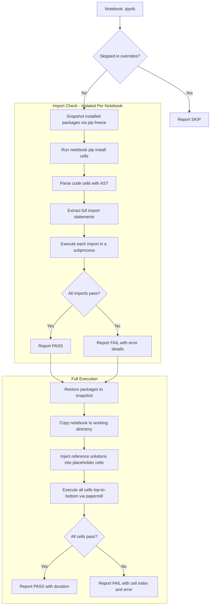
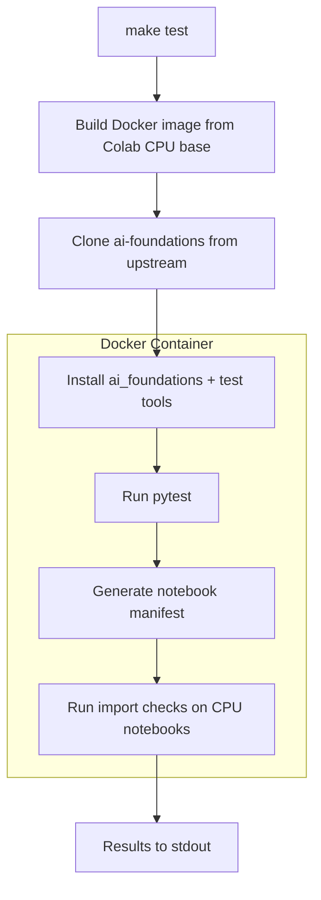
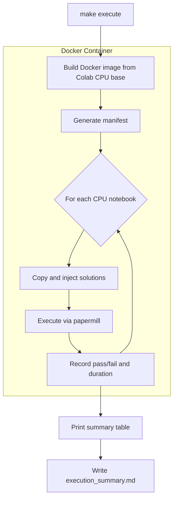
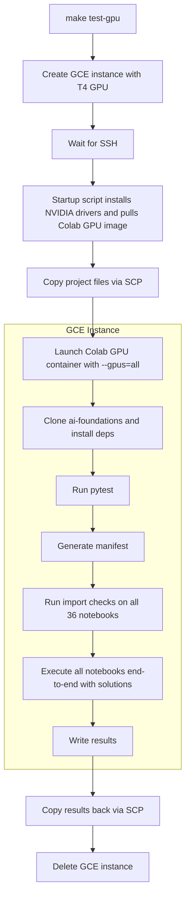
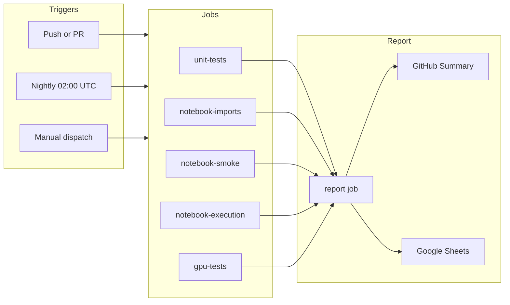

# Automated Notebook Testing for AI Foundations

Automated testing infrastructure for the [google-deepmind/ai-foundations](https://github.com/google-deepmind/ai-foundations) course notebooks.

This repo does **not** contain the notebooks themselves. It clones them fresh from upstream on every run to test the latest state.

## How It Works

All tests run inside the **official Google Colab Docker images** (CPU and GPU). This guarantees that test results match what students experience on Colab.

The system has three layers of testing:

1. **Unit tests** (`pytest`): Validate utility functions and feedback validators from the `ai_foundations` package. Solutions are extracted dynamically from notebooks and passed through upstream validation functions.

2. **Import checks** (`check_notebook.py`): Parse every notebook's code cells, run any `!pip install` commands, then verify all import statements resolve. Each notebook is checked in isolation (package state is snapshotted and restored between notebooks) to match Colab's per-notebook runtime model.

3. **Full execution** (`run_all_notebooks.py`): Inject reference solutions into activity placeholder cells and execute each notebook top-to-bottom via papermill. This catches runtime errors that import checks cannot detect.

## How a Single Notebook Is Tested



The environment for each notebook is set up as follows:

1. The Colab Docker image provides the base Python environment with pre-installed packages (the same set students get when they open a new Colab notebook).
2. `ai_foundations` is installed into that image at build time, just like running the first `!pip install` cell in a notebook.
3. Before checking imports, each notebook's own `!pip install` cells are executed. This mirrors how Colab runs those cells before the rest of the notebook.
4. After the check completes, all changed packages are restored to their original versions so the next notebook starts from a clean base. This matches Colab where each notebook gets its own fresh runtime.

## CPU Testing Workflow

CPU tests run locally in Docker using the official Colab CPU image.



For full notebook execution:



## GPU Testing Workflow

GPU tests run on an ephemeral GCE instance with a T4 GPU, using the official Colab GPU image.



The GCE instance is always deleted on exit, even if tests fail or the script is interrupted.

## GitHub Actions

The main workflow (`notebook-tests.yml`) runs on push, PR, nightly schedule (02:00 UTC), and manual dispatch.



| Job | Trigger | What |
|-----|---------|------|
| `unit-tests` | push/PR, nightly, manual | pytest |
| `notebook-imports` | push/PR, nightly, manual | Import checks (CPU notebooks) |
| `notebook-smoke` | push/PR, nightly, manual | Combined pytest + import checks |
| `notebook-execution` | nightly, manual | CPU notebooks end-to-end |
| `gpu-tests` | push/PR, nightly, manual | Full GPU testing on GCE T4 |
| `report` | always | Aggregate results to GitHub Summary + Google Sheets |

## Quick Start

```bash
# Run all CPU tests (pytest + notebook import checks)
make test

# Run import checks on all notebooks (GCE T4 instance)
make check-gpu

# Run full GPU tests: pytest + import checks + notebook execution (GCE T4 instance)
make test-gpu
```

### All Commands

| Command | Where | What |
|---------|-------|------|
| `make test` | Local Docker (CPU) | pytest + import checks (CPU notebooks only) |
| `make check` | Local Docker (CPU) | Import checks (CPU notebooks only) |
| `make check-all` | Local Docker (CPU) | Import checks for all 36 notebooks |
| `make check-gpu` | GCE T4 | Import checks for all 36 notebooks |
| `make execute` | Local Docker (CPU) | Execute CPU notebooks end-to-end |
| `make test-gpu` | GCE T4 | pytest + import checks + notebook execution |
| `make pytest` | Local Docker (CPU) | pytest only |
| `make shell` | Local Docker (CPU) | Debug shell |
| `make clean` | Local | Remove results + docker artifacts |

GPU commands spin up an ephemeral GCE T4 instance, run tests, copy results back, and delete the instance automatically.

## Notebook Classification

`generate_manifest.py` scans notebooks for GPU signals (markdown references to "T4 GPU", "Change runtime type", or code using `load_gemma()`, `keras_nlp.models.Gemma`, etc.) and classifies them automatically.

| Category | Count |
|----------|-------|
| CPU-only | 21 |
| GPU-required | 15 |
| Total | 36 |

Edit `notebook_overrides.yml` to force-skip notebooks or adjust settings:

```yaml
overrides:
  - path: course_5/gdm_lab_5_4_full_parameter_fine_tuning_of_gemma.ipynb
    skip: true
    reason: "Requires Kaggle credentials for Gemma model download"
```

## Project Structure

```
automated-rota-testing/
├── .github/workflows/
│   └── notebook-tests.yml              # Main workflow
├── tests/
│   ├── test_utilities.py               # ai_foundations utility function tests
│   └── test_feedback_solutions.py      # Solution extraction + validation tests
├── scripts/
│   ├── generate_manifest.py            # Auto-classify notebooks (GPU/CPU)
│   ├── check_notebook.py               # Validate syntax and imports
│   ├── inject_solutions.py             # Extract and inject solutions
│   ├── run_notebook.py                 # Execute a single notebook via papermill
│   ├── run_all_notebooks.py            # Orchestrate notebook execution
│   ├── write_results.py                # Parse outputs into structured JSON
│   ├── write_to_sheets.py              # Append results to Google Sheets
│   ├── gce_gpu_test.sh                 # Ephemeral GCE GPU instance lifecycle
│   ├── gce_startup.sh                  # GCE instance startup script
│   └── gce_install_deps.sh             # Install deps inside Colab container
├── Dockerfile                          # Colab CPU image
├── Dockerfile.gpu                      # Colab GPU image
├── docker-compose.yml                  # Local Docker testing
├── Makefile                            # Quick-access commands
├── notebook_overrides.yml              # Manual skip/timeout overrides
├── pyproject.toml                      # Project dependencies
└── uv.lock                             # Locked dependency versions
```

## Setting Up GCP for GPU Tests

GPU tests run on ephemeral GCE instances and authenticate using Workload Identity Federation (keyless).

### 1. Create a service account

```bash
export PROJECT_ID="your-project-id"
export PROJECT_NUMBER=$(gcloud projects describe $PROJECT_ID --format="value(projectNumber)")
export GITHUB_ORG="your-github-org"
export GITHUB_REPO="automated-rota-testing"

gcloud iam service-accounts create notebook-ci-runner \
  --display-name="Notebook CI Runner"

gcloud projects add-iam-policy-binding $PROJECT_ID \
  --member="serviceAccount:notebook-ci-runner@${PROJECT_ID}.iam.gserviceaccount.com" \
  --role="roles/compute.admin"
```

### 2. Create a Workload Identity Pool and Provider

```bash
gcloud iam workload-identity-pools create "github-pool" \
  --location="global" \
  --display-name="GitHub Actions Pool"

gcloud iam workload-identity-pools providers create-oidc "github-provider" \
  --location="global" \
  --workload-identity-pool="github-pool" \
  --display-name="GitHub Provider" \
  --attribute-mapping="google.subject=assertion.sub,attribute.repository=assertion.repository" \
  --issuer-uri="https://token.actions.githubusercontent.com"
```

### 3. Allow your GitHub repo to impersonate the service account

```bash
gcloud iam service-accounts add-iam-policy-binding \
  notebook-ci-runner@${PROJECT_ID}.iam.gserviceaccount.com \
  --role="roles/iam.workloadIdentityUser" \
  --member="principalSet://iam.googleapis.com/projects/${PROJECT_NUMBER}/locations/global/workloadIdentityPools/github-pool/attribute.repository/${GITHUB_ORG}/${GITHUB_REPO}"
```

### 4. Add GitHub secrets

| Secret | Value |
|--------|-------|
| `GCP_WORKLOAD_IDENTITY_PROVIDER` | `projects/<PROJECT_NUMBER>/locations/global/workloadIdentityPools/github-pool/providers/github-provider` |
| `GCP_SERVICE_ACCOUNT` | `notebook-ci-runner@<PROJECT_ID>.iam.gserviceaccount.com` |
| `GOOGLE_SPREADSHEET_ID` | The spreadsheet ID from the Google Sheets URL |

### 5. Enable required APIs

```bash
gcloud services enable iamcredentials.googleapis.com
gcloud services enable compute.googleapis.com
gcloud services enable sheets.googleapis.com
gcloud services enable drive.googleapis.com
```

### 6. Share the results spreadsheet

Share the Google Sheets results spreadsheet with the service account email as an **Editor**:

```
notebook-ci-runner@<PROJECT_ID>.iam.gserviceaccount.com
```

## Local Testing Without Docker

```bash
# 1. Install uv
curl -LsSf https://astral.sh/uv/install.sh | sh

# 2. Create venv and install dependencies
uv sync --extra cpu

# 3. Activate and clone upstream
source .venv/bin/activate
bash scripts/sync_upstream.sh

# 4. Install ai_foundations
uv pip install --no-deps -e ai-foundations

# 5. Run tests
uv run pytest tests/ -v --import-mode=importlib
uv run python scripts/generate_manifest.py
uv run python scripts/check_notebook.py --all --skip-gpu
```

Note: results may differ from Colab due to Python version and package differences. Use Docker for accurate results.
